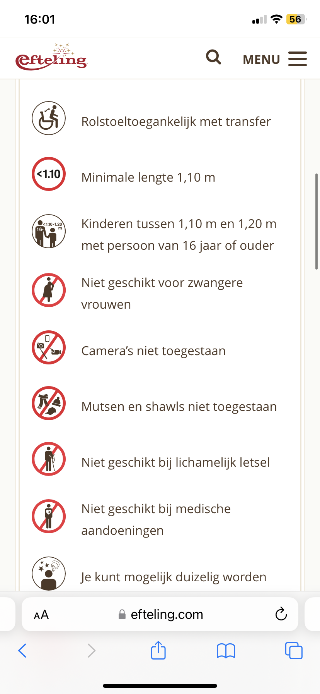

# Procesverslag
Markdown is een simpele manier om HTML te schrijven.  
Markdown cheat cheet: [Hulp bij het schrijven van Markdown](https://github.com/adam-p/markdown-here/wiki/Markdown-Cheatsheet).

Nb. De standaardstructuur en de spartaanse opmaak van de README.md zijn helemaal prima. Het gaat om de inhoud van je procesverslag. Besteedt de tijd voor pracht en praal aan je website.

Nb. Door *open* toe te voegen aan een *details* element kun je deze standaard open zetten. Fijn om dat steeds voor de relevante stuk(ken) te doen.

## Jij

  
uitwerken voor kick-off werkgroep

  ### Auteur:
  Merel de Boer

  #### Je startniveau:
  blauw/rood(kies uit zwart, rood óf blauw)

  #### Je focus:
  hier je focus (kies uit responsive óf surface plane)
 

## Je website

  
uitwerken voor kick-off werkgroep

  ### Je opdracht:
  https://www.efteling.com/nl

  link naar de website die je gaat namaken óf de naam/omschrijving van je eigen ontwerp

  #### Screenshot(s) van de eerste pagina (small screen): 
  actracties pagina 
  
  
  

  #### Screenshot(s) van de tweede pagina (small screen):
 Joris en de draak informatie pagina 
  
  
  
  
  
 

## Toegankelijkheidstest 1/2 (week 1)

  
uitwerken na test in 2e werkgroep

  ### Bevindingen
   Lijst met je bevindingen die in de test naar voren kwamen:
  - de naviagtie balk kan denk ik beter. door de tickets optie meer links te zetten zodat de bezoekers niet helemaal de website t ehoeven door te lopen.
  - De kaart is voor blinde mensen niet zo relevant en iritant als screen reader
  - de kopjes geven in het alegmeen goed aan wat er onder het kopje staat. 
  - bv: boek nu en ontvang 25% korting
  - de screenreader gefet meestal wel aan waar een link naar toe gaat.
  - op sommige foto's hebben ze ook een link maar hebben geen duidelijk isntructies. (bijvoorbeeld link op een pagina over een actractie van een foto)
  - links naar andere pagina's heel duidelijk
  - soms leest screen reader horizontaal splitsen voor. Wat denk ik niet nodig is.
  - kaart heel onhandig want als je door de pagina loopt gaat die alle opties in de kaart voor lezen terwijl je eigenlijk gewoon door wilt.
  - ook de talen optie vind ik bij de screen reader niethelemaal duidelijk door dat het niet een kopje heeft denk ik. 
  - op sommige pagina's hadden ze pijlen zodat je naar een bepaald gedeelte ging op de pagina maar dat was niet zo relevant omdat het maar naar 1 naar ondere ging.
  - pijl naar boven gaan zal fijn zijn want dan hoef je niet al die dingen opnieuw te hoeven luisteren
 
 resulaten WCAG test:
 - sommige elementen hebben geen teogankelijke namen
 - slechte kleur contras bij bijvoorbeeld de button met een groene achtergrond en witte letters
 - links geen herkenbare naam
 homepagina geen title
 - De viewpoint is niet perze disabled maar gaat maar tot een max.
 Ze kunnen maar tot 1.0 inzoomen
 <!-- <meta name="viewport" content="width=device-width, minimum-scale=1.0, initial-scale=1, shrink-to-fit=no"> -->
 - tabindex groter dan 0
 - kop elementen niet weergegeven in aflopende volgorde
 -afbeeldingen missen alternatieve teksten
 

 
 

## Breakdownschets (week 1)

  
uitwerken na afloop 3e werkgroep

  ### de hele pagina: 
  

  ### dynamisch deel (bijv menu): 
  

  ### wellicht nog een dynamisch deel (bijv filter): 
  

## Voortgang 1 (week 2)

  
uitwerken voor 1e voortgang

  ### Stand van zaken
  hier dit ging goed & dit was lastig (neem ook screenshots op van delen van je website en code)

  ### Agenda voor meeting
  samen met je groepje opstellen

  | student 1      | student 2          | student 3    | student 4        |
  | ---            | ---                | ---          | ---              |
  | dit bespreken  | en dit             | en ik dit    | en dan ik dat    |
  | en dat ook nog | dit als er tijd is | nog een punt | dit wil ik zeker |
  | ...            | ...                | ...          | ...              |

  ### Verslag van meeting
  hier na afloop snel de uitkomsten van de meeting vastleggen

  - punt 1
  - punt 2
  - nog een punt
  - ...

## Voortgang 2 (week 3)

  
uitwerken voor 2e voortgang

  ### Stand van zaken
  hier dit ging goed & dit was lastig (neem ook screenshots op van delen van je website en code)

  ### Agenda voor meeting
  samen met je groepje opstellen

  | student 1      | student 2          | student 3    | student 4        |
  | ---            | ---                | ---          | ---              |
  | dit bespreken  | en dit             | en ik dit    | en dan ik dat    |
  | en dat ook nog | dit als er tijd is | nog een punt | dit wil ik zeker |
  | ...            | ...                | ...          | ...              |

  ### Verslag van meeting
  hier na afloop snel de uitkomsten van de meeting vastleggen

  - punt 1
  - punt 2
  - nog een punt
- ...

## Toegankelijkheidstest 2/2 (week 4)

  
uitwerken na test in 9e werkgroep

  ### Bevindingen
  Lijst met je bevindingen die in de test naar voren kwamen (geef ook aan wat er verbeterd is):

## Voortgang 3 (week 4)

  
uitwerken voor 3e voortgang

  ### Stand van zaken
  hier dit ging goed & dit was lastig (neem ook screenshots op van delen van je website en code)

  ### Agenda voor meeting
  samen met je groepje opstellen

  | student 1      | student 2          | student 3    | student 4        |
  | ---            | ---                | ---          | ---              |
  | dit bespreken  | en dit             | en ik dit    | en dan ik dat    |
  | en dat ook nog | dit als er tijd is | nog een punt | dit wil ik zeker |
  | ...            | ...                | ...          | ...              |

  ### Verslag van meeting
  hier na afloop snel de uitkomsten van de meeting vastleggen

  - punt 1
  - punt 2
  - nog een punt
  - ...

## Eindgesprek (week 5)

  
uitwerken voor eindgesprek

  ### Je uitkomst - karakteristiek screenshots:
  

  ### Dit ging goed/Heb ik geleerd: 
  Korte omschrijving met plaatjes

  

  ### Dit was lastig/Is niet gelukt:
  Korte omschrijving met plaatjes

  

## Bronnenlijst

  
continu bijhouden terwijl je werkt

  Nb. Wees specifiek ('css-tricks' als bron is bijv. niet specifiek genoeg). 
  Nb. ChatGpT en andere AI horen er ook bij.
  Nb. Vermeld de bronnen ook in je code.

  1. bron 1
  2. bron 2
  3. ...

